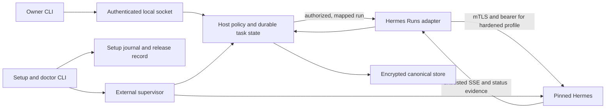

# Phase 02: Close the existing Host/Hermes foundation — Research

**Researched:** 2026-09-27
**Domain:** Go Host lifecycle, Hermes Runs integration, deployment evidence
**Confidence:** HIGH for repository contracts; MEDIUM for current Hermes documentation; LOW for unrun live gates

<user_constraints>
## User Constraints (from CONTEXT.md)

### Locked Decisions

### Authority and scope
- **D-01:** The approved master plan and GSD roadmap define the current Phase 02 exit. `docs/PHASE-2-HOST-HERMES.md` supplies dated implementation history and profile-specific evidence, not extra global release gates.
- **D-02:** One Host owns Space state, policy and task truth. Hermes runs behind the existing versioned adapter; externally managed Hermes remains independently supervised. Neither a profile digest nor a successful synthetic run proves process containment.
- **D-03:** Run E1 against the pinned runtime, including approval, clarification, stop, lost stream and restart. If a requested interaction lacks a supported API path, record it as unsupported and keep that path disabled until Phase 07 supplies a certified extension.
- **D-04:** Run E2 as negative attempts against file, network, tool and memory boundaries. A successful escape blocks the claimed restricted profile. Preserve exact runtime/configuration and redacted outcomes.

### Delivery and cleanup
- **D-05:** Reuse current setup, update/rollback and recovery mechanisms where they meet the contract. Restrict alpha container updates to the proven path if safe generation replacement cannot be verified in this phase.
- **D-06:** Preserve useful committed and uncommitted PR #20 conversation work on a recoverable branch, verify that preservation, then close draft PR #20. Do not merge it wholesale into this foundation phase. Remove only code or documentation with evidence of obsolescence, and ignore generated Python probe bytecode.
- **D-07:** A live check requires its named environment: a real update/rollback host, pinned Hermes, and two machines for cross-machine Runs. Record missing prerequisites as unverified; a fake endpoint never becomes live Hermes evidence.

### the agent's Discretion
Choose the smallest code changes, probe orchestration and evidence format consistent with the existing repository. Keep all security and recovery checks at real trust boundaries.

### Deferred Ideas (OUT OF SCOPE)
- Preserved PR #20 conversation, memory and node-status features belong to Phases 04–08 after independent review.
- Android Termux and other platform-profile gates qualify those profiles when claimed; they do not silently expand this Phase 02 exit.
</user_constraints>

<phase_requirements>
## Phase Requirements

| ID | Description | Research support |
|---|---|---|
| FR-01 | Create one private Space with one active Host and a recoverable owner identity. | Verify create-once bootstrap, identity/state continuity through setup rerun, crash and restart; state/key-loss recovery scope needs an explicit decision. [VERIFIED: .planning/REQUIREMENTS.md:11; internal/host/service.go:127-148,191-231] |
| FR-06 | Run the Host as a headless foreground process supervised externally under one portable executable contract. | Reuse `lumen-host serve` and existing supervisor definitions; demonstrate process and reboot behavior on the claimed machine. [VERIFIED: docs/PHASE-2-HOST-HERMES.md:68-69,100-101; test/contract/supervisor_test.go:148-208] |
| FR-08 | Provide resumable `lumen setup` that installs or adopts compatible Lumen and Hermes artifacts, generates configuration, and initializes Host state exactly once. | Reuse setup planner, journal, stages and create-once init; exercise fresh, interrupted, rerun, adoption and mismatch paths. [VERIFIED: .planning/REQUIREMENTS.md:18; internal/setup/runner.go:85-141; internal/host/service.go:127-148] |
| FR-09 | Supervise Host and Hermes at boot where supported and report exactly `ready`, `degraded`, or `action_required` without silent downgrade. | Test doctor against observed supervisor, boot, artifact and runtime evidence. Exact values: `"ready"`, `"degraded"`, `"action_required"`. [VERIFIED: internal/setup/model.go:5-19; internal/setup/doctor.go:42-160] |
| FR-38 | Integrate Hermes through a versioned adapter with discovery, runs, events, approvals, cancellation, and untrusted-result handling. | Reuse adapter and Host-owned reconciliation; add pinned-runtime behavioral probes where fake tests cannot establish compatibility. [VERIFIED: .planning/REQUIREMENTS.md:39; internal/hermes/client.go:181-192; internal/host/execution.go:828-954] |
| FR-41 | Expose Host-local Hermes reasoning first as `agent.run/execute` without granting transitive authority. | Keep current local capability and test denied, exact approval and restricted runtime behavior. Exact capability ID: `"agent.run/execute"`. [VERIFIED: .planning/REQUIREMENTS.md:42; scripts/lumen-macos-check:201-218; docs/PLAN.md:105-118] |
</phase_requirements>

## Summary

The phase is primarily qualification and targeted closure, not a new architecture. The existing Go Host, encrypted store, setup journal, doctor, release record and Hermes adapter cover the control flow; the master plan names seven remaining tasks and requires honest negative and recovery evidence. [VERIFIED: docs/PLAN.md:402-419; internal/setup/runner.go:85-141; cmd/lumen/release.go:80-149; internal/hermes/client.go:181-192]

Historical Azure combined/same-VPS external reboots and a native macOS pinned-gateway journey are recorded, while the phase still needs a real-machine executable update/rollback, pinned-runtime stream-loss/restart, actual two-machine external Runs, anonymous image pull, E1 and E2. The existing external script spins up a Python compatibility endpoint, so its passing result must stay labeled synthetic. [VERIFIED: docs/PHASE-2-HOST-HERMES.md:11-39; docs/PLAN.md:407-419; scripts/lumen-external-check:78-126]

**Primary recommendation:** Plan a short probe-first wave, then make only changes forced by a failed probe; retain separate result rows for automated, historical live, new live, and unverified evidence. [VERIFIED: docs/PLAN.md:387-390,402-419; .planning/research/BASELINE-EVIDENCE.md:8-25]

## Architectural Responsibility Map

| Capability | Primary tier | Secondary tier | Rationale |
|---|---|---|---|
| Space identity, policy and durable task truth | Host domain/storage | Operator CLI | Host commits transitions; runtime outputs are evidence. [VERIFIED: docs/ARCHITECTURE.md:82-89] |
| Setup, artifact update/rollback, doctor | Local deployment CLI | Supervisor/storage | CLI owns setup journal and artifact generation; supervisor reports operational state. [VERIFIED: cmd/lumen/main.go:126-175,551-625; cmd/lumen/release.go:80-149] |
| Runs, events, approvals and stop | Host orchestration | Hermes adapter | Host authorizes and persists; adapter normalizes untrusted HTTP/SSE. [VERIFIED: internal/hermes/client.go:181-192; docs/ARCHITECTURE.md:82-89] |
| Runtime containment | OS/container and Hermes process configuration | Host policy/adapter | Digest and response checks cannot prove actual file, network, tool or memory isolation. [VERIFIED: docs/PLAN.md:114-116; docs/THREAT_MODEL.md:95-98] |

## Standard Stack

| Component | Verified current identity | Use |
|---|---|---|
| Go Host and CLI | `go 1.27.1` in `go.mod`; local `go version go1.27.1 darwin/arm64`. [VERIFIED: go.mod:1-3; local `go version` 2026-09-27] | Existing binaries and tests; no new package recommended. |
| Pinned Hermes | Source tag `v2026.9.7`, peeled commit `2237be355906fbe6065ce1815711eee52b2d646e`, archive SHA-256 `907c2a72db1c5dd637ea8eeae97f4cb5b32cef615c17258f6b190924ec5bf688`; historical gateway reports `0.21.1`. [VERIFIED: docs/PHASE-2-HOST-HERMES.md:17-31; scripts/lumen-macos-check:116-120] | Reuse the exact pin for behavioral certification; verify artifact hash during each live run. |
| Deployment | Existing `mise.toml`, Docker Compose/systemd/launchd/runit definitions and shell probes. [VERIFIED: mise.toml:14-71; internal/setup/model.go:79-95] | Qualify only the topology and supervisor actually exercised. Exact supervisors: `"launchd"`, `"systemd"`, `"runit"`, `"docker"`. [VERIFIED: internal/setup/model.go:79-95] |

No external dependency installation is proposed; a Package Legitimacy Audit is therefore unnecessary. [VERIFIED: go.mod:1-3; docs/PLAN.md:407-419]

### Profiles and topology claims

The setup model's exact profiles are `"development"`, `"personal-alpha"`, `"hardened"`; exact topologies are `"combined"`, `"external"`; exact platform values are `"macos"`, `"linux"`, `"android-termux"`. [VERIFIED: internal/setup/model.go:36-49,71-77] The architecture says development permits synthetic compatibility shortcuts, personal is owner-operated with stated residual risk, and hardened requires enforceable isolation and pinned mutual identity. [VERIFIED: docs/ARCHITECTURE.md:69-79]

For Phase 02, qualify the combined Linux/VPS reference and each additional profile only with its own evidence. Native macOS plus containerized Hermes has a dated pinned-gateway journey; same-VPS external adoption is dated lifecycle evidence; Termux same-UID is compatibility only and its physical/security profile gate remains separate. [VERIFIED: docs/PHASE-2-HOST-HERMES.md:11-39,87-90; docs/THREAT_MODEL.md:53-55; .planning/phases/02-close-the-existing-host-hermes-foundation/02-CONTEXT.md:70-75]

### Alternatives considered within locked scope

| Decision | Use now | Escalate only when |
|---|---|---|
| Container image updates | Restrict alpha updates to the executable generation path already implemented. | A safe, independently verified container generation swap and rollback is demonstrated; otherwise report the image path unsupported. [VERIFIED: cmd/lumen/release.go:20-31,108-148; docs/PLAN.md:413-415] |
| Clarification | Keep ordinary clarification disabled if E1 finds no exact supported response path. | Phase 07 certifies an extension that distinguishes an answer from an approval; documented steer alone is insufficient. [VERIFIED: docs/PLAN.md:118,496-501; .planning/phases/02-close-the-existing-host-hermes-foundation/02-CONTEXT.md:16-20] [CITED: https://hermes-agent.nousresearch.com/docs/developer-guide/programmatic-integration] |
| External Hermes proof | Use two real machines, pinned mutual TLS and existing Host-only supervision. | A fake endpoint remains useful solely for repeatable contract tests. [VERIFIED: docs/PLAN.md:409-415; docs/PHASE-2-HOST-HERMES.md:11-21; scripts/lumen-external-check:78-126] |

## Architecture Patterns



The diagram follows the documented Host-local path and deployment boundary; external topology leaves Hermes under independent supervision. [VERIFIED: docs/ARCHITECTURE.md:69-89; docs/PHASE-2-HOST-HERMES.md:11-21]

### Existing implementation seams

| Work | Reuse | Only extend if |
|---|---|---|
| Setup/doctor | `internal/setup/`, `cmd/lumen/main.go`, `internal/host/service.go` | A fresh/rerun/interruption/boot probe reveals a contract violation. [VERIFIED: internal/setup/runner.go:85-141; internal/setup/doctor.go:42-160] |
| Update/rollback | `cmd/lumen/release.go`, `internal/setup/release.go` | Real executable replacement or pending-generation recovery fails. Image replacement currently returns `"image_update_requires_deployment"`; keep that restriction if no safe container path is proven. [VERIFIED: cmd/lumen/release.go:20-31,108-148; cmd/lumen/release_test.go:279-289] |
| E1 Runs | `internal/hermes/client.go`, `internal/hermes/events.go`, `internal/host/execution.go` | Pinned runtime differs from fake-server contract. [VERIFIED: internal/hermes/client.go:181-192; internal/host/execution_test.go:141-186,821-845] |
| E2 containment | Existing deployment profile and OS/container controls | Restricted profile demonstrably allows unauthorized file/network/tool/memory reach. Do not interpret the profile digest as isolation. [VERIFIED: docs/PLAN.md:114-116,362-363] |

### Profile and evidence rule

Record topology, Host OS/architecture, supervisor, Hermes source commit/image digest/runtime version, exact configuration digest, endpoint identity, credentials *by role only*, command/probe revision, timestamp, redacted result, and affected requirement/threat. Keep raw credentials and private content out of artifacts. A historical reboot or fake endpoint never upgrades a different profile to live proof. [VERIFIED: docs/PLAN.md:686-688,387-390; docs/PHASE-2-HOST-HERMES.md:23-39; docs/THREAT_MODEL.md:120-142]

### Executable probe matrix

| Gate | Required observation | Honest failure outcome |
|---|---|---|
| Fresh setup and FR-01/06/08/09 | On a named supported machine: clean install or adoption, authenticated connection, create-once state, interruption/rerun, foreground Host, supervisor boot/reboot, redacted doctor. [VERIFIED: docs/PLAN.md:407-410; docs/PHASE-2-HOST-HERMES.md:53-69] | Identity change, silent reinit, unready service or false `"ready"` fails the gate; exact doctor values are `"ready"`, `"degraded"`, `"action_required"`. [VERIFIED: internal/setup/model.go:5-19; docs/PLAN.md:416-419] |
| Native update and rollback | Replace a real pinned executable generation; verify changed digest, service health and preserved Space/owner/Host IDs; roll back offline and verify old digest and unchanged state; inject failed replacement and restart with pending record. [VERIFIED: docs/PLAN.md:410; cmd/lumen/release.go:123-209; cmd/lumen/release_test.go:79-97,231-239] | Report `action_required`/unverified if replacement or rollback cannot be proven; do not count unit tests as live artifact proof. [VERIFIED: docs/PHASE-2-HOST-HERMES.md:17-21,33-39] |
| E1 pinned interactions | Record run ID, task ID and Host evidence for exact `once` and `deny`, ordinary clarification request/answer if supported, in-flight stop, lost SSE, Host restart and gateway restart. Reconcile status by deadline and prove no duplicate create after ambiguous dispatch. [VERIFIED: docs/PLAN.md:362,411,415-419; docs/PHASE-2-HOST-HERMES.md:92-109] | An unavailable API path is unsupported and disabled; an ambiguous create becomes `"unknown_outcome"` after bounded reconciliation, never a fabricated completion. [VERIFIED: .planning/phases/02-close-the-existing-host-hermes-foundation/02-CONTEXT.md:16-20; internal/space/model.go:39-53] |
| Cross-machine external Runs | Host on machine A calls pinned Hermes on machine B with independently managed lifecycle, mutual TLS and bearer; stop/restart Host without changing Hermes identity; submit a real Run and verify durable result. [VERIFIED: docs/PLAN.md:412; docs/PHASE-2-HOST-HERMES.md:11-21,87-90] | Same-VPS or Python endpoint result remains compatibility evidence only. [VERIFIED: docs/PHASE-2-HOST-HERMES.md:11-21; scripts/lumen-external-check:78-126] |
| Anonymous image pull | Fresh unauthenticated client pulls exact pinned image digest; record HTTP/registry result and digest. [VERIFIED: docs/PLAN.md:413; docs/PHASE-2-HOST-HERMES.md:17-18] | Private or mismatched image is a distribution failure, even if authenticated/local build works. [VERIFIED: docs/PHASE-2-HOST-HERMES.md:17-18] |
| E2 restricted profile | Attempt: read/write outside selected file root and Host secrets; arbitrary network egress; unapproved tool/action or self-grant; unrelated/stale memory or context access. Capture target policy, effective OS/container controls and redacted denial evidence. [VERIFIED: docs/PLAN.md:114-116,362-363; docs/THREAT_MODEL.md:83-89,96-98,108] | Any successful escape blocks the specific restricted profile claim. An externally managed endpoint cannot prove a hostile operator's internal configuration. [VERIFIED: docs/PLAN.md:114-116,362-363] |

## Don't Hand-Roll

| Problem | Use instead | Reason |
|---|---|---|
| Setup checkpointing or executable generation management | Existing journal and release record | They already implement durable binding, pending record recovery and rollback. [VERIFIED: internal/setup/runner.go:85-141; cmd/lumen/release.go:123-209] |
| Task event authority or retry loop | Existing Host transition/reconciliation path | Create intent precedes runtime I/O; ambiguous creates are not blindly retried. [VERIFIED: docs/PHASE-2-HOST-HERMES.md:92-96; internal/host/execution_test.go:165-258] |
| New Hermes protocol or clarification API | Existing documented Runs endpoints; mark unsupported where pin fails | Current docs document steer only for a running run, with `200` meaning queued. This is not a certified clarification answer path. [CITED: https://hermes-agent.nousresearch.com/docs/developer-guide/programmatic-integration] |
| Synthetic external endpoint for a live gate | Existing fake endpoint for automated contract tests only | It cannot establish pinned Hermes or cross-machine behavior. [VERIFIED: scripts/lumen-external-check:78-126; docs/PLAN.md:409-415] |

## Common Pitfalls

1. **Capability flag mistaken for behavior.** The adapter must check discovery and the *pinned* runtime must pass approval, event, status and stop behavior; current main-branch Hermes docs are a guide, not evidence for the pinned artifact. [VERIFIED: docs/PHASE-2-HOST-HERMES.md:84-92] [CITED: https://hermes-agent.nousresearch.com/docs/developer-guide/programmatic-integration]
2. **Steer mistaken for clarification.** `run_steer` is optional in this repo; documented steer is running-only and queued for a later tool boundary. Probe a real ordinary question/answer path; otherwise record unsupported and leave disabled until Phase 07. Exact feature flag: `"run_steer"`. [VERIFIED: internal/hermes/client.go:27-33,467-490; docs/PLAN.md:118] [CITED: https://hermes-agent.nousresearch.com/docs/developer-guide/programmatic-integration]
3. **SSE mistaken for durable history.** A lost or single-consumer stream needs bounded status reconciliation and Host records; test after actual Host and gateway interruption, with no redispatch after ambiguous create. [VERIFIED: docs/PHASE-2-HOST-HERMES.md:92-109; internal/host/execution_test.go:186-258,821-845]
4. **Synthetic profile mistaken for containment.** E2 needs explicit denied attempts in each file, network, tool and memory class against the deployed restricted profile; one successful escape blocks that profile. [VERIFIED: docs/PLAN.md:114-116,362-363; docs/THREAT_MODEL.md:83-89,96-98]
5. **Same-VPS external mistaken for two machines.** Existing historical external proof preserved independent lifecycle on one VPS; Phase 02 task 4 specifically requires another machine and actual Runs. [VERIFIED: docs/PHASE-2-HOST-HERMES.md:11-21; docs/PLAN.md:409-415]
6. **Private image claim from a logged-in pull.** Test anonymous pull of the exact image digest and capture the result; if inaccessible, report distribution blocked rather than editing the pin or calling a local cache public. [VERIFIED: docs/PHASE-2-HOST-HERMES.md:17-18; docs/PLAN.md:413]

## Code Examples

The following is the existing fail-closed optional steering check, quoted verbatim; it is a guide to reuse, not a new clarification design. Exact feature flag `"run_steer"` is defined in the cited source. [VERIFIED: internal/hermes/client.go:27-33,467-474]

```go
caps, err := c.Capabilities(ctx)
if err != nil {
    return err
}
if !featureEnabled(caps.Features, CapabilityRunSteer) {
    return fmt.Errorf("%w: missing %s", ErrUnsupported, CapabilityRunSteer)
}
```

The existing doctor outcome contract is exactly `"ready"`, `"degraded"`, `"action_required"`; use those values in probe assertions and report labels. [VERIFIED: internal/setup/model.go:5-19]

## Validation Architecture

### Test framework

| Property | Value |
|---|---|
| Framework | Go `testing` from Go 1.27.1; existing contract tests. [VERIFIED: go.mod:1-3; test/contract/setup_hermes_run_test.go:1-20] |
| Config | `mise.toml` with `phase2-check`, `milestone1-linux-check`, `milestone1-macos-check`, `milestone1-external-check`. [VERIFIED: mise.toml:14-71] |
| Quick run | `go test ./internal/setup ./internal/host ./internal/hermes ./cmd/lumen ./test/contract -count=1` [VERIFIED: mise.toml:14-71; existing package directories] |
| Full suite | `mise run phase2-check` on a machine with Android SDK; then the matching live deployment check and manual probes. [VERIFIED: mise.toml:14-71; docs/PHASE-2-HOST-HERMES.md:116-124] |

### Requirements to checks

| Requirement | Existing automated anchor | Required Phase 02 proof |
|---|---|---|
| FR-01 | `go test ./internal/host -run 'TestInit|TestVerifyInitialized' -count=1` [VERIFIED: internal/host/service_test.go:114-304] | Fresh identity, setup rerun, crash/restart, retained state and owner recovery semantics. |
| FR-06/09 | `go test ./internal/setup ./cmd/lumen ./test/contract -run 'TestSupervisor|TestDoctor' -count=1` [VERIFIED: internal/setup/supervisor_test.go:24-257; cmd/lumen/doctor_service_test.go:16-313] | Foreground process, boot/reboot and honest doctor on claimed profile. |
| FR-08 | `go test ./internal/setup ./cmd/lumen -run 'TestJournal|TestSetup' -count=1` [VERIFIED: internal/setup/journal_test.go:86-182; cmd/lumen/main_test.go:319-552] | Pinned clean install/adopt, interrupted resume, credential/state continuity; real executable update/rollback. |
| FR-38/41 | `go test ./internal/hermes ./internal/host ./test/contract -run 'TestCreate|TestDisconnect|TestRuntimeApproval|TestStop|TestSetupCreatedDeployment|TestConfiguredHermesRunsCertification' -count=1` [VERIFIED: internal/hermes/client_test.go:89-152,368-386; internal/host/execution_test.go:486-845; test/contract/setup_hermes_run_test.go:41,370] | E1 pinned run/approval/clarification/stop/lost stream/restart and E2 four negative boundary classes. |

### Sampling and Wave 0

Run the quick Go tests after a code change; run `mise run phase2-check` before phase gate on a capable machine; run live probes once per exact runtime/profile revision and repeat only after relevant changes. Existing test infrastructure is present. Wave 0 should create no new framework or fixtures until a specific failing probe identifies a missing assertion. [VERIFIED: mise.toml:14-71; docs/PLAN.md:387-390,402-419]

## Security Domain

`security_enforcement` is `true` in `.planning/config.json`; Phase 02 crosses the operator, Host-store and Host-Hermes boundaries. [VERIFIED: .planning/config.json; docs/THREAT_MODEL.md:34-55]

| ASVS category | Applies | Phase 02 control |
|---|---|---|
| V2 Authentication | yes | Independent operator credential, bearer and mutual endpoint identity. [VERIFIED: docs/THREAT_MODEL.md:95-96,120-123] |
| V3 Session Management | limited | Bind active runtime/session evidence; reject stale or replaced runtime identity where this phase claims it. [VERIFIED: docs/THREAT_MODEL.md:108-109] |
| V4 Access Control | yes | Host policy before dispatch and exact once/deny forwarding; no transitive runtime grant. [VERIFIED: docs/THREAT_MODEL.md:83-85,111-117] |
| V5 Input Validation | yes | Bound and validate HTTP/SSE, IDs, metadata and response fields at adapter boundary. [VERIFIED: internal/hermes/client.go:38-50,181-192; internal/hermes/events.go:107-197] |
| V6 Cryptography | yes | Existing encrypted store plus pinned mutual TLS in hardened profile; credentials remain separate. [VERIFIED: docs/PHASE-2-HOST-HERMES.md:74-77,87-90; docs/THREAT_MODEL.md:122-123] |

The V2–V6 names above use the OWASP ASVS 4.0 taxonomy; applicability is a phase-specific inference from the cited repo boundaries. [CITED: https://wiki.owasp.org/images/d/d4/OWASP_Application_Security_Verification_Standard_4.0-en.pdf]

Priority threats are T-011 false success after crash/lost events, T-017 operator impersonation, T-018 Hermes endpoint/approval/event confusion, and T-030 runtime feature expansion. E2 must demonstrate process or container controls, not merely Host refusal after Hermes already reached an unauthorized resource. [VERIFIED: docs/THREAT_MODEL.md:89,95-98,108]

## Environment Availability

| Dependency | Needed for | Observed here | Fallback / planner action |
|---|---|---|---|
| macOS arm64, Go | Native Host build and tests | `Darwin arm64`, `go1.27.1`; available. [VERIFIED: local `uname -sm`, `go version` 2026-09-27] | Use local quick tests. |
| mise, Docker Compose | Existing gates | `mise 2026.8.3`, Compose `v5.5.1`, Docker daemon `29.7.2` available outside this sandbox. The in-sandbox daemon probe was permission denied. [VERIFIED: local `mise --version`, `docker compose version`, `docker info` 2026-09-27] | Run Docker-dependent probes with authorized daemon access and record the specific result. |
| Pinned source archive | Local pinned gateway build | `hermes-source.tar.gz` exists locally; hash was not checked in this research. The script defines and, when absent, creates that path. [VERIFIED: scripts/lumen-macos-check:22-23,135-156; local `ls -l hermes-source.tar.gz` 2026-09-27] | Existing scripts validate SHA-256 before use. [VERIFIED: scripts/lumen-macos-check:135-156] |
| Real Linux/update host; second machine | Reboot, executable update/rollback, cross-machine Runs | Not probed in this research. [ASSUMED] | Treat as prerequisites, not passed gates. |
| Android SDK/physical Termux | Legacy `phase2-check`/Termux profile | SDK not probed; physical Termux remains outside this phase's global exit. [ASSUMED] [VERIFIED: .planning/phases/02-close-the-existing-host-hermes-foundation/02-CONTEXT.md:70-75; mise.toml:34-35] | Run full suite where SDK exists; do not infer Termux profile acceptance. |

## Resolved planning questions (execution still requires evidence)

1. **(RESOLVED for planning)** FR-01's Phase 02 claim is create-once owner/Host identity and intact-key state continuity across setup interruption and process restart. Full backup/export/restore remains Phase 10. Do not mark the whole FR complete if its stated recovery contract is not met. [VERIFIED: .planning/REQUIREMENTS.md:11; internal/host/service.go:191-231; .planning/ROADMAP.md:38-46,117-124]
2. **(RESOLVED for planning)** Ordinary clarification is not an assumed pinned Runs capability. E1 must observe a supported response path on `v2026.9.7`; until then it remains disabled and unverified under D-03. [VERIFIED: docs/PLAN.md:118,362; .planning/phases/02-close-the-existing-host-hermes-foundation/02-CONTEXT.md:16-20] [CITED: https://hermes-agent.nousresearch.com/docs/developer-guide/programmatic-integration]
3. **(RESOLVED for planning)** E2 must use a named owner-controlled restricted profile with its effective OS/container settings recorded before negative file/network/tool/memory probes. Any escape fails containment; without such a profile E2 remains unverified and Phase 02 cannot complete. [VERIFIED: docs/PLAN.md:114-116,362-363; docs/THREAT_MODEL.md:96-98]

## Assumptions Log

| # | Claim | Section | Risk if wrong |
|---|---|---|---|
| A1 | A real Linux/update host and second machine can be supplied during execution. | Environment availability | Live gates remain unverified. |
| A2 | Android SDK availability is unknown in this research environment. | Environment availability | Full legacy gate may need a different host. |

## Project Constraints (from AGENTS.md)

- Keep one Host as Space authority; Hermes and companions are adapters/surfaces; default deny, local policy for local work, Host authorization for cross-node work, action-bound one-time approvals. [VERIFIED: AGENTS.md:3-13,50-52]
- Before implementation name governing requirement, validation check, assumptions, alternatives, observable success and failure behavior; choose the smallest vertical slice; avoid speculative abstractions and unrelated cleanup. [VERIFIED: AGENTS.md:15-40]
- Preserve independent credentials, private data minimization, redacted operational evidence, idempotency and honest uncertainty; do not commit runtime state or secrets. [VERIFIED: AGENTS.md:9-13,32-40]
- Keep domain contracts independent of UI, platform, Hermes, transport and storage; add a generic abstraction only when at least two real callers need the same contract. [VERIFIED: AGENTS.md:9-13,32-34]
- If execution has independent bounded workstreams, use one coordinator and at most three workers with exact ownership; avoid parallel edits to shared schemas, state machines, migrations or files, and independently review security-sensitive changes. [VERIFIED: AGENTS.md:42-48]
- Use `mise run phase0-check` for the current cross-platform baseline; update affected canonical docs with implementation; independent review is required for protocol, authorization, persistence, migration and sandbox changes. [VERIFIED: AGENTS.md:54-58,68]
- Use concise Markdown, sentence-case headings, stable IDs and valid cross-document links; release tags are annotated semantic versions with notes in `docs/CHANGELOG.md`. [VERIFIED: AGENTS.md:54-58,68]
- Use a short-lived branch based on fetched `origin/main`, Conventional Commits and reviewed PRs; inspect staged diff and run relevant checks before commit. [VERIFIED: AGENTS.md:60-68]
- Use the existing graph for codebase navigation; after code modification run `graphify update .`. This research makes no code change. [VERIFIED: AGENTS.md:70-81]
- Prefix shell commands with `rtk` under the imported RTK rule; use the project-supplied `ctx7` CLI sequence for current library/API documentation. [VERIFIED: /Users/ashwanthreddyboddireddy/.codex/RTK.md:1-18; user-supplied AGENTS.md instructions]

## Sources and confidence

**HIGH:** Current in-repo definitions and tests opened during this research: `docs/PLAN.md`, `docs/PHASE-2-HOST-HERMES.md`, `docs/ARCHITECTURE.md`, `docs/THREAT_MODEL.md`, `.planning/REQUIREMENTS.md`, `.planning/ROADMAP.md`, `internal/setup/`, `internal/host/`, `internal/hermes/`, `cmd/lumen/`, `mise.toml`, and existing probes. Historical live claims retain their dated/profile limits. [VERIFIED: cited files above]

**MEDIUM:** Current official Hermes documentation fetched via Context7, which does not certify the repository's pinned tag: [programmatic integration](https://hermes-agent.nousresearch.com/docs/developer-guide/programmatic-integration), [API server](https://hermes-agent.nousresearch.com/docs/user-guide/features/api-server). Context7 confidence seam returned `MEDIUM` for this provider. [CITED: https://hermes-agent.nousresearch.com/docs/developer-guide/programmatic-integration] [CITED: https://hermes-agent.nousresearch.com/docs/user-guide/features/api-server]

**LOW/unverified:** Real-machine update/rollback, cross-machine Runs, pinned lost-stream/restart, E1 clarification and E2 containment until executed with named environments. [VERIFIED: docs/PLAN.md:407-419; .planning/STATE.md:54-57]

**Research cache note:** The first `research-store put` attempt failed with `EPERM` under the workspace sandbox; both Context7 digests were then cached successfully with authorized access. [VERIFIED: local command output 2026-09-27]
